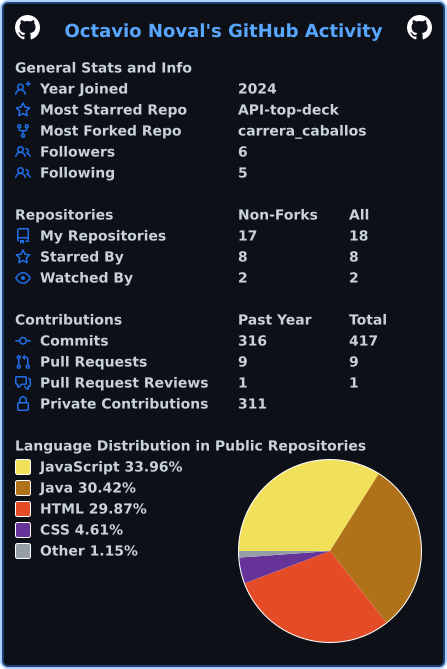

# Octavio Noval

**Full-Stack Developer** — TUP student at UTN, passionate about building real-world applications from the database to the frontend.

I focus on clean architecture, team collaboration, and writing code that ships. I work mostly with Java/Spring Boot for backends and React/React Native for frontends, with a growing interest in DevOps and infrastructure.

---

## Tech Stack

**Languages**  
       

**Frameworks & Libraries**  
  

**Tools & Platforms**  
    

---

## Featured Project

### [M3Almacenamiento-api](https://github.com/OctavioDNoval/M3Almacenamiento-api)

A warehouse management API built with **Java** and **Spring Boot**, designed to handle inventory, stock movements, and storage operations. RESTful architecture with a clean layered structure.

  

---

## GitHub Stats

---

*Profile visitors — *
